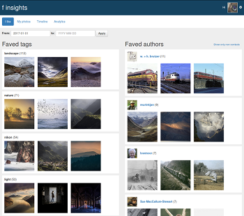
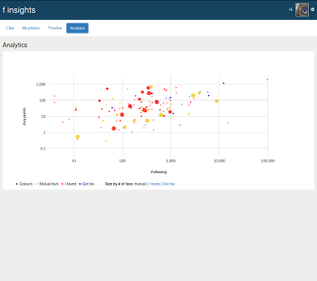

# f insights
Web app presenting statistics of your activity on flickr.

> This is my playground for learning Scala, Play Framework, Akka & Cassandra or whatever else I will decide to include
> in this project in future. You can find more information about the project on [my blog](http://michal.sznurawa.pl/f-insights/).


 

## Setup 
### Requirements
* You will need to have preinstalled Java, Scala, SBT, nodejs, npm and docker.
* You need to have an active Flickr account.
* You will have to create a [flickr app](https://www.flickr.com/services/apps/create/) and obtain app key & secret.
* You will have to generate [Play Framework secret](http://www.playframework.com/documentation/latest/ApplicationSecret). 
### Frontend
Start from building the UI:
```
sudo npm install -g npx
npm install
npx grunt
```
### DB
The second step is to setup the DB.

Start from building the image and running the container:
```
sudo mkdir /var/data
sudo chmod 700 /var/data
sudo docker build -t="michajls/fa-cassandra" ops/cassandra/
sudo docker run -d  -v /var/data/fa-cassandra/:/var/lib/cassandra --name fa-cassandra michajls/fa-cassandra
```

Check the IP of `fa-cassandra` container:
```
sudo docker network inspect bridge
```

Now you will start another Cassandra container, but instead of starting the server, you run cqlsh and connect to the `fa-cassandra` container as user `cassandra`.
The default password is `cassandra`. Put in place of $IP the IP you acquired by inspecting the network.
```
sudo docker run -it --link fa-cassandra:cassandra --rm michajls/fa-cassandra cqlsh $IP  -u cassandra
```
Once you are logged in, change the password for `cassandra` user:
```
ALTER USER cassandra WITH PASSWORD 'password';
```
**and manually create DB schema from db/structure.cql** (auto migrations not yet implemented).

### App
Prepare the environment.
```
export FA_APP_KEY=?
export FA_APP_SECRET=?
export FA_DB_HOST=?
export FA_DB_USER=cassandra
export FA_DB_PASSWORD=?
export FA_CRYPTO_SECRET=?
```

* `FA_APP_KEY`, `FA_APP_SECRET` - flickr app key, to be obtained by [creating a new flickr app](https://www.flickr.com/services/apps/create/).  
* `FA_DB_HOST` - IP of `fa-cassandra` container obtained earlier with `sudo docker network inspect bridge`.
* `FA_DB_USER` - db user name, `cassandra` unless you created a new user.
* `FA_DB_PASSWORD` - db user password, set while setting up db.
* `FA_CRYPTO_SECRET` - encryption secret needed by [Play Framework](http://www.playframework.com/documentation/latest/ApplicationSecret).

And finally, let the `sbt` do the rest of job for you:  
```
sbt compile
sbt run
```
You can reach the app under `http://localhost:9000/`. You will not see any data yet, but if the app dicoveres that you don't have a dashboard,
 it will start slowly fetching data from fa and building a new dashboard, so refresh the page after few minutes.
 
Readings
=========
* Flickr  API Docs: https://www.flickr.com/services/api/
